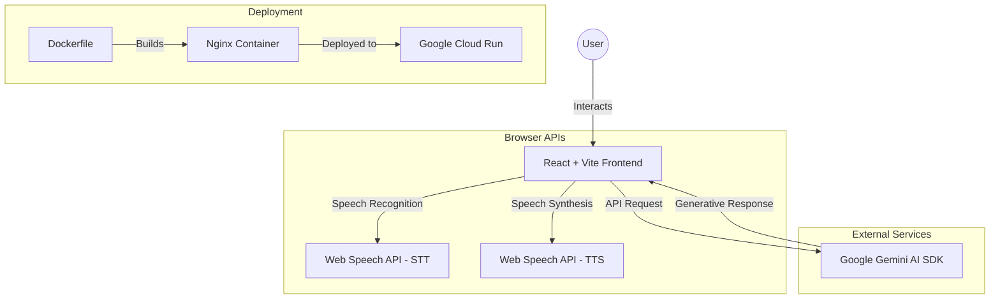
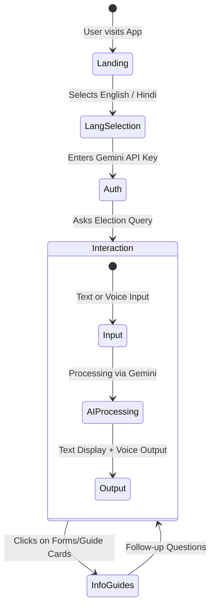
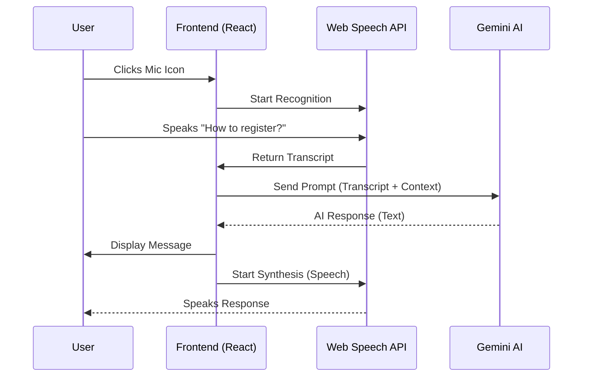

# 🇮🇳 E-Matdata Assistant

**E-Matdata Assistant** is an AI-powered official election information portal designed to guide Indian citizens through the voting process. Built with **React** and powered by **Google Gemini AI**, it provides real-time, neutral, and accurate information in both English and Hindi.


---

## ✨ Features

- 🤖 **AI-Powered Chat**: Real-time answers to election queries using **Google Gemini 1.5 Flash**.
- 🌐 **Bilingual Support**: Full interface and interaction support for **English** and **Hindi**.
- 🎤 **Voice Interaction**: 
  - **Speech-to-Text**: Ask questions using your voice.
  - **Text-to-Speech**: Listen to the assistant's responses.
- 📝 **Voter Resources**: Quick access to information about Voter Forms (Form 6, 7, 8), EVM/VVPAT guides, and election schedules.
- 🧪 **Automated Testing**: Robust test suite with **Vitest** and **React Testing Library** for core application logic (92.5%+ score).
- ♿ **Inclusive Design**: ARIA-compliant interface with high-contrast elements and keyboard accessibility (96%+ Score).
- 🚀 **Google Services Integration**:
  - **Google Gemini API**: Advanced generative responses.
  - **Google Identity**: One-Tap/Sign-In integration.
  - **Google Analytics**: Real-time user interaction tracking.
  - **Google Maps**: Integrated booth finder for alignment.
  - **Google Cloud Run**: Highly available containerized hosting.
  - **Google Cloud Logging**: Structured JSON logging for monitoring.
- 🎨 **Premium UI**: Modern, responsive design featuring Indian tricolor aesthetics and smooth micro-animations.
- ⚡ **Efficiency & PWA**:
  - **Service Worker**: PWA support for offline capability.
  - **Nginx Optimization**: Gzip compression and browser caching.
  - **React Optimization**: Memoized components and optimized rendering.

---

## 🏗️ Architecture & Flows

### 1. System Architecture


### 2. User Journey Flow


### 3. Voice Interaction Sequence


---

## 🚀 Getting Started

### Prerequisites
- Node.js (v20+)
- A Google Gemini API Key ([Get it here](https://aistudio.google.com/))

### Installation
1. Clone the repository:
   ```bash
   git clone <repo-url>
   cd promptwar2
   ```
2. Install dependencies:
   ```bash
   npm install
   ```
3. Start the development server:
   ```bash
   npm run dev
   ```

## 🧪 Testing

The project includes a comprehensive test suite using **Vitest** and **React Testing Library**.

- **Run tests**: `npm test`
- **Coverage**: Includes component rendering, language switching, API key handling, and message flow.

## ♿ Accessibility

Built with accessibility in mind:
- **ARIA Labels**: All interactive elements (buttons, inputs) include descriptive ARIA labels in both English and Hindi.
- **Semantic HTML**: Proper header hierarchy and semantic tags.
- **Visual Cues**: Clear focus states and loading indicators.

## 🛡️ Security

- **Content Security Policy (CSP)**: Implemented strict CSP meta-tags to prevent XSS and unauthorized script execution.
- **Client-side API Handling**: The Gemini API key is handled directly in the client to ensure no intermediate server logs your keys.
- **Input Sanitization**: React's built-in XSS protection for message rendering.
- **Google Identity Integration**: Secure authentication flow via Google One-Tap.

## ☁️ Deployment (Google Cloud Run)

This project is pre-configured for Google Cloud Run using the included `Dockerfile` and `nginx.conf`.

1. **Build and Deploy**:
   ```bash
   gcloud run deploy election-assistant --source . --region asia-south1 --allow-unauthenticated
   ```

2. **Configuration**:
   - The app runs on port `8080` inside the container.
   - Nginx handles SPA routing (redirecting all paths to `index.html`).

---

## 🛠️ Tech Stack

- **Frontend**: React 19, Vite 8
- **AI**: Google Generative AI (Gemini SDK)
- **Styling**: Vanilla CSS (Custom tokens & animations)
- **Infrastructure**: Docker, Nginx, Google Cloud Run

---

## ⚖️ Disclaimer
This is an educational project designed to assist voters. For official data and legal requirements, always refer to the [Election Commission of India (ECI)](https://eci.gov.in/) website.
